# 👋 Hi, I'm Rajwardhan

<picture>
<source alt ="card" src = "Stark_Ind.svg">
</picture>

<picture>
  <source media="(prefers-color-scheme: dark)" srcset="dark.svg">
  <source media="(prefers-color-scheme: light)" srcset="light.svg">
  
</picture>

---

### 🚀 About Me

- 🎓 B.Tech in Computer Science & Engineering at D.Y. Patil School of Engineering (DYPSN)
- 📍 Kolhapur, Maharashtra, India
- 🎯 Currently focused on **Cloud & AI**
- 💻 Full Stack Developer | AI Enthusiast | Open Source Contributor

### 🛠️ Tech Stack

**Languages:** C, C++, Python, Java, JavaScript, Kotlin  
**Frontend:** React.js, Tailwind CSS, HTML5, CSS3  
**Backend:** Node.js, Express.js, Next.js  
**Databases:** MongoDB, PostgreSQL, Firebase  
**DevOps & Tools:** Docker, AWS, Git, GitHub, Kubernetes

### 🤝 Connect with Me

>>>>>>> 3ab9588 (Profile)
